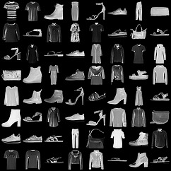

# DDPM (PyTorch)

A clean, from-scratch implementation of **Denoising Diffusion Probabilistic Models** (Ho et al., 2020) and **DDIM** sampling (Song et al., 2020) in PyTorch, trained and evaluated on FashionMNIST.

This project implements the full diffusion pipeline end-to-end without relying on `diffusers` or other high-level libraries, with production-grade engineering practices (modular code, externalised configs, reproducibility, evaluation pipeline).

<p align="center">
  
  <br>
  <em>64 samples generated with DDPM-1000 from a 14.4M-parameter U-Net trained for 30k steps on FashionMNIST.</em>
</p>

## Results

Evaluated on 50 000 generated samples vs the FashionMNIST test set (10 000 images).
FID computed with [`clean-fid`](https://github.com/GaParmar/clean-fid) (Parmar et al., 2022), Inception Score with `torchmetrics`.

| Sampler         | Steps | η   | FID ↓     | IS ↑              | Speedup vs DDPM-1000 |
|-----------------|------:|----:|----------:|-------------------|---------------------:|
| **DDPM**        |  1000 | n/a | **10.74** | 4.28 ± 0.06       |                  1×  |
| **DDIM**        |    50 | 0.0 |     19.39 | **4.41 ± 0.04**   |                 20×  |

**Notes:**
- DDPM-1000 yields the best FID, as expected — it is the qualitative reference.
- DDIM-50 with deterministic sampling (η=0) provides a **20× speedup** with a moderate FID increase, demonstrating the practical value of sub-sampling DDIM for fast inference.
- We also experimented with DDIM-250 across multiple η values (0.0, 0.5, 1.0). On this compact 14M-parameter model, deterministic DDIM over 250 steps accumulates prediction errors that push samples toward the clip boundary (over-saturation), while stochastic variants (η > 0) trade determinism against fidelity. Neither configuration outperformed DDIM-50 on FID, suggesting that for this model size, 50 steps is the practical sweet spot. Larger architectures (35M+ parameters) typically resolve this and show monotonic FID improvement with more sampling steps.

## Implementation

**Architecture (U-Net, 14.4M params)**
- 3 resolution levels with `(64, 128, 256)` channels
- 2 residual blocks per level with sinusoidal timestep embeddings injected at every block
- Single-head self-attention at the bottleneck (7×7 resolution)
- GroupNorm + SiLU activations throughout
- Nearest-neighbor upsampling to avoid checkerboard artifacts

**Diffusion**
- `T = 1000` timesteps, cosine schedule (Nichol & Dhariwal, 2021)
- ε-parametrization with simple MSE objective
- EMA over model weights (β=0.9999) for inference

**Training**
- 30k steps, batch size 128, AdamW (lr=2e-4)
- Gradient clipping at 1.0
- ~45 minutes on a single NVIDIA RTX 5070

## Project structure

```
ddpm-pytorch/
├── src/ddpm/             # Core package
│   ├── data/             # Datasets (FashionMNIST, CIFAR-10)
│   ├── models/           # UNet, EMA, building blocks
│   ├── diffusion/        # Noise schedules, forward/reverse processes
│   ├── training/         # Trainer, losses
│   ├── evaluation/       # FID, Inception Score
│   └── utils/            # Seed, logger, device, config, checkpoint
├── configs/              # YAML configs (base.yaml + dataset-specific)
├── scripts/              # train.py, sample.py, evaluate.py
└── notebooks/            # Schedule and forward process visualizations
```

## Setup

Requires **Python 3.14+** and [**uv**](https://docs.astral.sh/uv/) (modern Python package manager).

```bash
git clone https://github.com/<you>/ddpm-pytorch.git
cd ddpm-pytorch
uv sync --extra dev
```

This creates a `.venv/`, resolves dependencies (including PyTorch with CUDA 13.0), and generates a lockfile for full reproducibility.

## Usage

### Train

```bash
uv run python scripts/train.py --config configs/fashion_mnist.yaml --run-name baseline
```

Outputs (checkpoints, TensorBoard logs, intermediate samples) are written to `outputs/fashion_mnist_baseline/`.

### Sample

```bash
uv run python scripts/sample.py \
    --checkpoint outputs/fashion_mnist_baseline/checkpoints/step_0030000.pt \
    --config outputs/fashion_mnist_baseline/config.yaml \
    --num-samples 64 \
    --sampler ddim \
    --steps 50
```

### Evaluate

```bash
uv run python scripts/evaluate.py \
    --checkpoint outputs/fashion_mnist_baseline/checkpoints/step_0030000.pt \
    --config outputs/fashion_mnist_baseline/config.yaml \
    --num-samples 50000 \
    --samplers ddim50 ddim250 ddpm1000
```

Results (FID, IS) are saved as JSON under `outputs/.../evaluation/metrics.json`.

## Future work

Natural extensions of this project, in order of impact:
- **Classifier-free guidance** (Ho & Salimans, 2022) for class-conditional generation (e.g. "generate a shoe").
- **v-parametrization** (Salimans & Ho, 2022) as an alternative to ε-prediction, often more stable for short sampling trajectories.
- **DPM-Solver** (Lu et al., 2022) for faster sampling (10-25 steps with quality close to DDPM-1000).
- **CIFAR-10** training (config provided) to evaluate on a more challenging benchmark.
- **Larger architecture** (35M+ params, attention at multiple resolutions) to study the deterministic-DDIM drift observed at 250 steps.

## References

- Ho, J., Jain, A., & Abbeel, P. (2020). [*Denoising Diffusion Probabilistic Models*](https://arxiv.org/abs/2006.11239). NeurIPS.
- Song, J., Meng, C., & Ermon, S. (2020). [*Denoising Diffusion Implicit Models*](https://arxiv.org/abs/2010.02502). ICLR.
- Nichol, A., & Dhariwal, P. (2021). [*Improved Denoising Diffusion Probabilistic Models*](https://arxiv.org/abs/2102.09672). ICML.
- Parmar, G., Zhang, R., & Zhu, J.-Y. (2022). [*On Aliased Resizing and Surprising Subtleties in GAN Evaluation*](https://arxiv.org/abs/2104.11222). CVPR.

## License

[MIT](LICENSE)